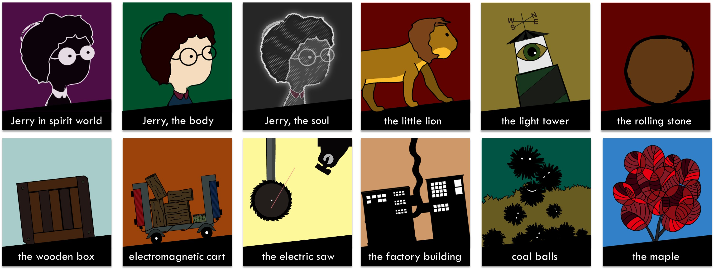
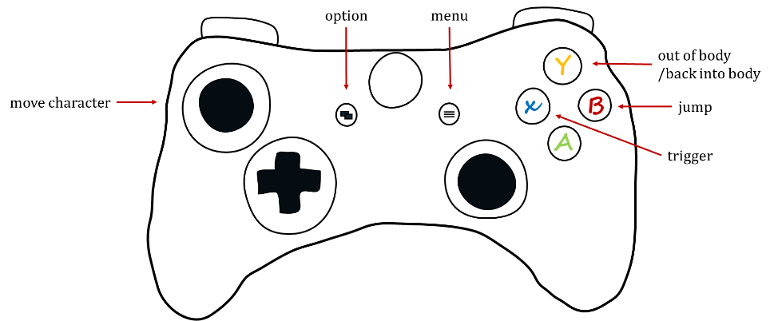

# My Spirit

*A 2D hand-drawn-style game competed in MS Imagine Cup 2016*

MY SPIRIT is an adventure/puzzle game using 2d hand-drawn art style. It tells the story about the legendary life of Jerry from the spirit world to the real world. MY SPIRIT discusses the relationship between people’s body and their spirit. Players use keyboard or xbox one controller to control the characters. With the unique gameplay called ‘Out of Body’, players have the acess to switch the protagonist’s state between ‘body’ and ‘soul’so that we can help Jerry overcome the problems.
The game is adapted according to Jerry’s memories at his ripe old age of 98.

## Game specs
* Genre: Adventure/Puzzle
* Target rating: E10(ages 10+)
* Target platform: Windows PC/XBOX
* Language：English
* Average game length: 1 hour
* Version: v1.0.0(beta)

## Story
Jerry was born in 1949. Like most people, he leads an extraordinary life. However, some day he found himself has the memory of his preexistence. He thought that everybody has a shinny star inside our body and before we were born we were just these stars floating in the sky seeking for the beautiful body we desire to live in. The stars would turn to the soul once they found the body belong to their heart and started a journey from the spirit world to find the body. Fortunately, Jerry was the lucky one who was chosen. In the real world, Jerry was companied with his soul. There are far more challenges and puzzles waiting for them to face…

The video game was divided into five phases according to Jerry’s memories at his ripe old age of 98: 
Prologue: 1948
Chapter I: 1949
Chapter II: 1974
Chapter III: 2002
Epilogue: 2047

## USP (Unique Selling Points)
* 2d hand-drawn style
* Storytelling: black-fairy-tale style; weird/vivid animation
* Unique gameplay: ‘Out of Body’
* The first person narration

## Gameplay summary
In MY SPIRIT, players will first be introduced by Jerry’s memoirs and start the adventure. In this game, Players use keyboard or game controller to control the main character in order to solve the puzzles and complete the adventure. The core gameplay of this game can be divided into two parts: in Prologue: 1948 and Chapter I: 1949, players can control the character to walk/jump/climb/trigger in order to win. While in Chapter II: 1974 and Chapter III: 2002, in addition to the operations mentioned above, we add ‘Out of Body’, that means players can use this function in the state of flesh, then the character’s body and soul will be separated. At this moment, players can only control the soul to go up/down/right/left. The action of the soul can also influence the real world. With the help of the soul, the character may solve the problems better, but remember that the time to keep this state is limited, Once the soul left the body for a long time, the character will die. 

> *the state of flesh: refer to the state that the soul and body are not separated.*

## Player controls
* XBOX one

* PC

## Game experience
* In MY SPIRIT, we put the game into a story, thus the experience consists of the experience of playing the game and the experience of listening to the story.
* The game experience can be divided into the following five ‘Phases’.

|PHASE|PLACE|PLOT|
|-|-|-|
|Prologue: 1948|Spirit world|Jerry started the journey of  seeking for the body from spirit world. |
|Chapter I: 1949|Real world: woods|Jerry came to the real world. What he saw was just about woods which represent the primitive civilization. He found the boy’s body which he had been seeking near a ginkgo tree. After the body and the soul completed the combination, Jerry began his adventure. However, the new soul was in a chaotic state and Jerry had no ability to use ‘Out of Body’.|
|Chapter II: 1974|Real world: factory|Years later, Jerry was in his youth. He came to the Industrial world, which was the symbol of modern civilization. The Industrial world brought about more puzzles, which were solved by Jerry using ‘Out of body’.|
|Chapter III: 2002|Real world: city|2002, Jerry came to the city, the city world was colorful yet full of temptations. With the help of his soul, he finally passed the last test about human nature.|
|Epilogue: 2047|Real world: city/spirit world|Jerry began to recall his life at the ripe old age of 98 and wrote the memoirs. He passed away peacefully in 2047. soon later, his soul left his body forever and back to the spirit world.|

## Game Mechanics
* Camera
    * MY SPIRIT uses rail camera, 2d characters, elements and terrain. The camera is controlled by the designer so that we can achieve a better view of the game scene. The character, in most cases, is in the center of the camera. While the character moves, the camera moves. In some cases, we use Wide Shot(WS)/Very Wide Shot(VWS)/Close Up(CU).

* HUD
    * health bar: used when the character is in the state of ‘Out of Body’
    * Control information

* Level
    * A chapter is made of several interactive loops which are grouped together into a game loop
    * The game consists of a helical game loop
    * Increase the difficulty and contents in the spiral model
    * Groove design: to make tension and keep it moderate while providing easy-to use operation for players
    * Put our story into the game; follow the example of the narrative technique in theatres

For more information, please contact [kxie_shake@outlook.com](mailto:kxie_shake@outlook.com)

